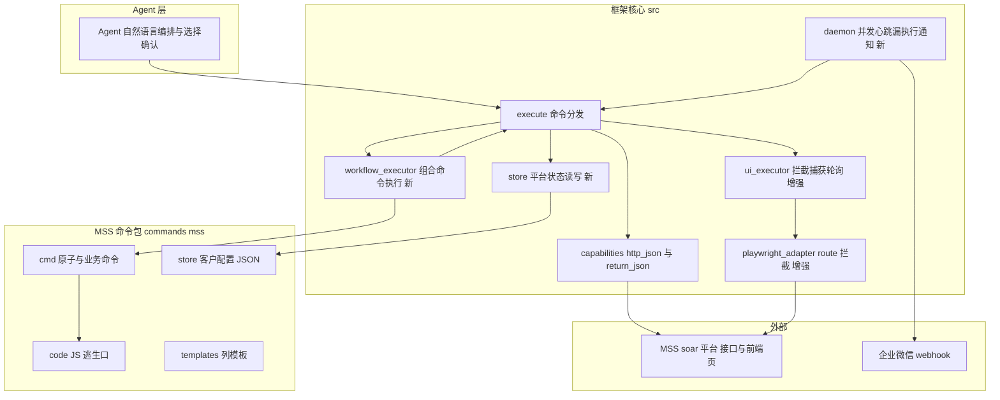
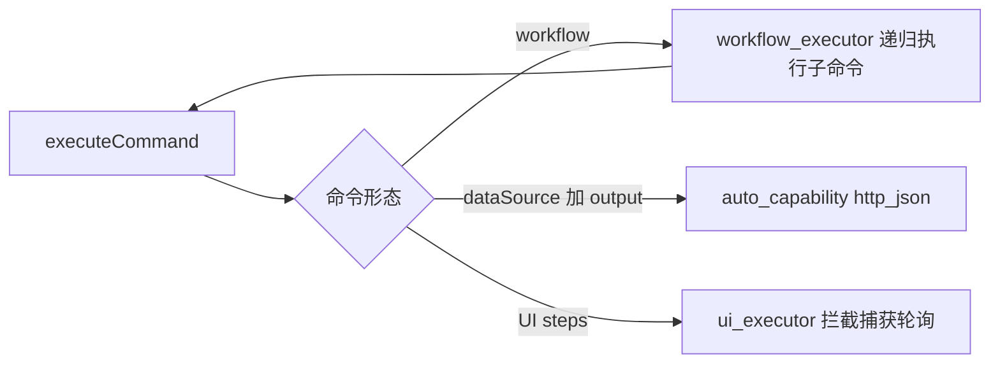

# MSS 报告命令化 + 框架编排/调度增强 模块需求与设计一体化文档

> **文档编号**: MOD-MSS-CMD-v0.1
> **文档版本**: v0.1
> **创建日期**: 2026-06-15
> **文档状态**: 草稿

**评审边界说明**:
- **需求评审**: 第 2 章（需求分析）→ 通过后锁定需求基线
- **设计评审**: 第 3-4 章（技术设计 + 部署运维）→ 通过后锁定设计基线
- **交接契约**: 2.5 验收条件 — 需求定义 What，设计实现 How

**ID 体系**: US（用户故事）、FEAT（功能）、API（接口/命令/函数）、RULE（业务规则/系统约束）、TC（测试用例）、RISK（风险）、NFR（非功能指标）
场景编号：S-（正常）、E-（异常）、B-（边界）

---

## 目录

- [1. 文档控制](#1-文档控制)
- [2. 需求分析](#2-需求分析)
- [3. 技术设计](#3-技术设计)
- [4. 部署与运维](#4-部署与运维)
- [5. 风险与依赖](#5-风险与依赖)
- [6. 需求追溯矩阵](#6-需求追溯矩阵)
- [附录：术语表](#附录术语表)

---

## 1. 文档控制

### 1.1 责任人

| 角色 | 姓名 | 职责范围 |
|------|------|---------|
| 产品/需求方 | xuwenbin | 需求定义、业务验收 |
| 开发负责人 | | 框架增强 + 命令实现 |
| 测试负责人 | | 测试策略、质量保证 |

### 1.2 修订历史

| 版本 | 日期 | 作者 | 变更描述 |
|------|------|------|---------|
| v0.1 | 2026-06-15 | align 对话 | 初始草稿，沉淀对齐结论 |

---

## 2. 需求分析

### 2.1 需求概述 [必填]

| 项目 | 内容 |
|------|------|
| **模块名称** | MSS 报告命令化 + 框架编排/调度增强 |
| **模块ID** | MOD-MSS-CMD |
| **所属系统/产品线** | `@jahanxu/platform-command`（MCP 优先命令框架） |
| **需求类型** | 技术重构 + 新功能（框架能力增强） |
| **业务背景** | 现有 `mss-report-skill` 是基于 Claude Skill（SKILL.md + Python 脚本 + 后台 daemon）实现的 MSS 海外客户周报/月报工作流。需将其转换为 platform-command 框架的原生命令，复用框架统一的命令分发、鉴权、dry-run、验收契约能力。 |
| **核心目标** | 在**零功能降级**前提下，把 MSS skill 转为框架命令；并为框架补齐三项**通用可复用**能力：①命令编排（workflow 执行引擎）②可复用调度 daemon（并发/心跳/漏执行/通知）③导出所需的浏览器响应拦截执行能力。 |

### 2.2 痛点与价值 [必填]

| 维度 | 内容 |
|------|------|
| **目标用户** | ①MSS 运营（通过 agent 自然语言下发指令导报告/配置/定时）；②平台开发者（复用原子命令组合新业务命令）。 |
| **当前问题** | ①skill 与框架两套体系并存，MSS 逻辑无法复用框架统一能力；②skill 的 Python daemon 写死 MSS（只扫 `companies/*.json`、只调 `trigger_export.py`、推送写死企业微信），换平台需重写；③框架缺真正的命令编排执行引擎（现有 workflow 仅 dry-run plan，`execute.ts` 判定 `executable:false / api_plan`）；④框架的 `schedule.ts` 仅落宿主 cron，无并发/无心跳/无漏执行检测，且对需登录态命令会无人值守失败（`REQUIRES_INTERACTIVE_SESSION`）。 |
| **业务影响** | 能力不收敛、不可复用；调度若用框架现状替换 daemon 即为功能降级（丢并发/漏执行/通知）。 |
| **预期价值** | MSS 全流程进入框架统一模型；新增的编排/调度/拦截三项能力平台无关，后续任意平台可复用；原子命令可组合成业务命令。 |

**用户故事**

| 编号 | 用户故事 | 优先级 |
|------|---------|--------|
| US-01 | 作为运营，我希望用自然语言让 agent 导出某客户周报/月报，以便无需手工操作平台 | P0 |
| US-02 | 作为运营，我希望设定定时后到点自动「导出→（按开关）发邮件→同步 portal」，并在停机后登录时被告知期间漏执行了哪些，以便不漏报 | P0 |
| US-03 | 作为运营，我希望查看/修改客户配置、邮箱、定时，以便维护每个客户的报告策略 | P0 |
| US-04 | 作为平台开发者，我希望原子命令能被组合成新的业务命令并复用，以便快速搭建跨命令流程 | P0 |
| US-05 | 作为运营，我希望手动查邮件话术/发邮件/同步 portal/查报告状态，以便人工干预 | P1 |

---

### 2.3 功能方案 [必填]

#### 2.3.1 功能清单

| 功能ID | 功能名称 | 功能描述 | 优先级 | 来源 |
|--------|---------|---------|--------|------|
| FEAT-01 | 平台 store 层 | 每个平台命令包下新增 `store/` 目录（`commands/<platform>/store/<key>.json`），框架提供相对平台目录的读写辅助，持久化业务状态（MSS 客户配置）。通用、平台无关。 | P0 | US-03,US-04 |
| FEAT-02 | workflow 执行引擎 | 命令可声明 `workflow.steps[]`，step 可引用其它命令（`command`+`params`+`when`+`extract`），引擎顺序/依赖执行、递归调 `executeCommand`、把上游输出管道到下游。组合命令=可执行业务命令。 | P0 | US-04,US-01,US-02 |
| FEAT-03 | 导出浏览器拦截执行 | 扩展 Playwright UI 执行：`page.route` 拦截改写响应（改 `get_history_pwd.export_locales`）+ 监听响应捕获（`generate_report` 取 task_id）+ 轮询（`report_status` 至 `task_status=1`）。通用拦截/捕获/轮询能力。 | P0 | US-01 |
| FEAT-04 | 可复用调度 daemon(TS) | 通用调度引擎：schedule store（`{command,params,cron,timezone}`）+ worker 池并发(`maxWorkers`) + 心跳文件 + 漏执行回放 + 可插拔 notifier。到点调 `executeCommand`，认命令名不认平台。 | P0 | US-02 |
| FEAT-05 | MSS 原子命令集 | `mss.search_company` / `report_status` / `get_locale` / `set_locale` / `query_email_content` / `send_email` / `sync_portal` / `export_report`。 | P0 | US-01,US-05 |
| FEAT-06 | MSS 配置命令集 | `mss.display_config` / `update_config` / `update_email` / `set_schedule`（读写 FEAT-01 store）。 | P0 | US-03 |
| FEAT-07 | MSS 业务组合命令 | `mss.export_weekly` / `mss.export_monthly`（workflow：导出→按 `report_check`/`send_email`/`sync_portal` 开关条件执行下游）；`mss.export_all_configs`（配置汇总→Excel→通知）。 | P0 | US-01,US-02 |

#### 2.3.2 字段约束（FEAT-01 客户配置 store 对象）

| 字段名 | 字段类型 | 必填 | 约束 | 说明 |
|--------|---------|------|------|------|
| company_name | string | 否 | | 客户名（解析后回填） |
| weekly_range_type | string | 是 | `Last 7 days`/`Last week` | 周报范围，默认 `Last week` |
| monthly_range_type | string | 是 | `Last month`/`Last 30 days` | 月报范围，默认 `Last month` |
| report_check | boolean | 是 | | 需人工检查则跳过自动下游，默认 false |
| send_email | boolean | 是 | | 导出后自动发邮件，默认 false |
| sync_portal | boolean | 是 | | 导出后自动同步 portal，默认 false |
| weekly_emails_added/removed | object | 是 | `{recipient,cc,bcc:[]}` | 用户邮箱增删 delta |
| monthly_emails_added/removed | object | 是 | 同上 | |
| weekly_schedule | object\|null | 是 | `{weekday,time,display}` | 周报定时，null=无 |
| monthly_schedule | object\|null | 是 | `{monthday,time,display}` | 月报定时，null=无 |

---

### 2.4 范围与边界 [必填]

| 类别 | 内容 |
|------|------|
| **范围（In Scope）** | ①框架三项通用能力 FEAT-01~04；②MSS 原子/配置/业务命令 FEAT-05~07；③对齐结论中 skill 全部对外功能的等价实现。 |
| **非范围（Out of Scope）** | ①不保留 Python 运行时（daemon 用 TS 重写，业务逻辑迁入命令/JS 逃生口）；②不改 MSS 平台后端接口；③多客户模糊匹配的"让用户选"交互仍由 agent 完成（命令只返回候选列表）。 |
| **前置假设** | ①运行形态为 Docker headless 容器（遵循 CLAUDE.md，禁假设交互式终端/桌面）；②鉴权用 `browser_session_cookie`（webbridge/playwright storageState）复用登录态；③MSS 接口路径与字段同 `shared/api.py` 实测。 |
| **有意妥协 / 技术债** | ①时间范围计算、logo 清洗+默认 module_list 兜底、find_newer_report 日期比较等纯逻辑用 command-local JS 逃生口（`commands/mss/code/*.js`）实现，不进核心框架；②首期 notifier 先实现企业微信 webhook 一种，接口预留可插拔。 |

---

### 2.5 验收条件 [必填]

#### 2.5.1 业务规则与约束（平台操作铁律 / SOP）

> 迁移自原 skill「全局规则 + 禁止事项」。脚本类旧规则（`--output-file`、严禁改脚本）不适用命令框架，已剔除。

| ID | 类型 | 描述 |
|----|------|------|
| RULE-01 | 业务规则 | 导出必须明确报告类型（weekly/monthly）；未指定由 agent 追问，命令不臆测。 |
| RULE-02 | 业务规则 | task_id 必须由用户提供，命令不猜测/补全；company_id 可由命令查询。 |
| RULE-03 | 业务规则 | 命令报错/非 0 code 原样返回，禁止自动重试、禁止连续重试同一命令；401/403 提示刷新登录态，禁止跳过/忽略鉴权错误。 |
| RULE-04 | 系统约束 | 同一客户的多命令串行，不并发；daemon 全局并发上限 = `maxWorkers`（默认 3）；批量为跨不同客户并发，单客户内仍串行。 |
| RULE-05 | 系统约束 | 邮箱增删只能走 `update_email`，禁止经 `update_config` 改邮箱。 |
| RULE-06 | 系统约束 | 收件人 = 平台配置邮箱 + 本地 added − 本地 removed（store delta）。 |
| RULE-07 | 系统约束 | 轮询须有 sleep 与超时上限，禁止忙等（CLAUDE.md 禁忌）。 |
| RULE-08 | 业务规则 | 禁止拼接/猜测参数：参数须来自用户明确提供或 store 已有值。 |
| RULE-09 | 业务规则 | 客户名称由用户提供、模糊匹配由命令处理；返回多候选时让用户/agent 选，禁止替选或自猜 company_id。 |
| RULE-10 | 业务规则 | 禁止在用户未明确要求时自动触发 导出 / 发邮件 / 同步 portal。 |
| RULE-11 | 业务规则 | 纯业务交流时只用业务语言回应，不暴露内部字段名/技术细节（用户追问内部细节除外）。 |
| RULE-12 | 业务规则 | 定时时间须 HH:MM 24h；解析存疑先与用户确认，不擅自填入。 |

#### 2.5.2 功能验收场景

**正常场景**

| 场景ID | 功能ID | 优先级 | 前置条件 | 操作步骤 | 预期结果 |
|--------|--------|--------|---------|---------|---------|
| S-01 | FEAT-05 | P0 | 已登录会话 | 执行 `mss.search_company keyword=XX` | 返回 return_json，rows 含 companyId/companyName |
| S-02 | FEAT-05 | P0 | 已登录 | `mss.report_status` | 返回报告列表（分页累计） |
| S-03 | FEAT-01/06 | P0 | 客户无配置 | `mss.display_config company=XX` | 自动初始化默认配置并展示 |
| S-04 | FEAT-03/05 | P0 | 已登录 | `mss.export_report company=XX reportType=weekly` | 打开导出页、拦截改写 export_locales、捕获 generate_report 得 task_id、轮询至 task_status=1 |
| S-05 | FEAT-02/07 | P0 | 配置 send_email=true,sync_portal=true | `mss.export_weekly company=XX` | 顺序执行 导出→发邮件→同步 portal，上游 task_id 管道到下游 |
| S-06 | FEAT-04 | P0 | 配置含周报定时 | 启动 daemon，到点 | 入队并由 worker 执行 `mss.export_weekly`，并发不超 maxWorkers |
| S-07 | FEAT-04 | P0 | 10:00 应跑、11:00 才启动 | 启动 daemon | 读心跳算出停机期间漏执行项并经 notifier 推送 |
| S-08 | FEAT-06 | P0 | — | `mss.set_schedule company=XX weekly="每周三 10:00"` | 写 store.weekly_schedule，daemon 下次扫描注册 |

**异常场景**

| 场景ID | 功能ID | 触发条件 | 系统行为 | 用户感知 |
|--------|--------|---------|---------|---------|
| E-01 | FEAT-05 | 会话过期 401 | 原样返回鉴权错误，不重试 | 提示刷新登录态 |
| E-02 | FEAT-05 | keyword 命中多个客户 | 返回候选列表 | agent 让用户选择后再调 |
| E-03 | FEAT-03 | generate_report 600s 未捕获 | 标记超时失败 | 提示稍后在平台确认 |
| E-04 | FEAT-02 | 子命令失败 | 中止 workflow 并回传失败步骤 | 明确哪步失败 |
| E-05 | FEAT-04 | 触发时无登录态 | 记录失败 + notifier 告警 | 收到失败通知 |

**边界场景**

| 场景ID | 字段/条件 | 边界值 | 预期行为 |
|--------|----------|--------|---------|
| B-01 | maxWorkers | 任务数>worker 数 | 超出排队，不丢任务 |
| B-02 | monthday | 31 而当月 30 天 | 取当月最后一天（同 daemon `_iter_trigger_times`） |
| B-03 | 小语种 | 不支持的语种 | 接口返回错误，原样回传 |

#### 2.5.3 非功能指标

| 指标ID | 指标名称 | 目标值 | 测量方法 |
|--------|---------|-------|---------|
| NFR-PERF-01 | 导出后台轮询上限 | ≤30min（同 MAX_POLL_COUNT×POLL_INTERVAL） | 代码常量 |
| NFR-REL-01 | 漏执行检测 | 停机期间应触发任务 100% 被回放识别 | 单测覆盖 `_iter_trigger_times` 等价逻辑 |
| NFR-SEC-01 | 凭据 | 命令内不落明文 Cookie/secret，鉴权走会话适配器 | 代码审查 + redactSensitive |

---

## 3. 技术设计

### 3.1 方案选型 [必填]

#### 关键决策记录

| 决策点 | 选择 | 被否决项 | 理由 | 可逆性 |
|--------|------|---------|------|--------|
| 调度能力 | TS 重写通用 daemon | 复用 `schedule.ts`(cron) | cron 无并发/无心跳/无漏执行，且需登录态命令无人值守失败=降级 | 难 |
| 编排 | 新增 workflow 执行引擎 | 仅靠 agent 编排 / 仅 dry-run plan | 需把"导出→发邮→同步"固化为可复用业务命令，agent 编排无法被 daemon 调度复用 | 中 |
| 配置存储 | 每平台 `commands/<platform>/store/` | 框架全局 store / 保留 Python `companies/` | 状态与平台命令包内聚、随包分发；通用模式但不耦合 MSS 路径 | 中 |
| 导出 | UI 拦截执行（page.route 改写+捕获+轮询） | http_json 直调 | 导出依赖前端页触发 + 响应 MITM 改 export_locales，非纯接口 | 难 |
| 复杂纯逻辑 | command-local JS 逃生口 `code/*.js` | 进核心框架 / agent 计算 | 时间范围、logo 清洗、newer 检测属业务逻辑，隔离在命令包内 | 易 |

#### 技术栈

| 类别 | 选型 | 版本 | 选型理由 |
|------|------|------|---------|
| 语言 | TypeScript (ESM/NodeNext) | 同仓 | 框架既有约定 |
| 浏览器自动化 | Playwright | ^1.52（optional dep） | 既有 `playwright_adapter`，支持 page.route |
| 鉴权 | browser_session_cookie（webbridge/storageState） | — | 复用登录态，免管 cookies.txt |
| 运行形态 | Docker headless 容器 | — | CLAUDE.md 唯一部署形态 |

---

### 3.2 架构设计 [必填]



#### 技术分层（执行路径）



#### 外部依赖清单

| 外部系统 | 依赖类型 | 协议 | 超时 | 降级策略 |
|---------|---------|------|------|---------|
| MSS soar 平台 | 接口+前端页 | HTTPS | 接口 30s / 导出 600s | 原样回传错误，不重试 |
| 企业微信 webhook | 通知 | HTTPS | 短超时 | 通知失败仅记日志，不阻断主流程 |

---

### 3.3 数据设计 [必填]

> 无关系型数据库；持久化为平台命令包内的 JSON 文件 store。

**目录布局（新增 `store/`）**

```
commands/mss/
  cmd/        # 命令定义（原子+业务）
  config/     # 参数 defaults
  templates/  # 列模板
  code/       # command-local JS 逃生口
  store/      # 新增：业务状态持久化
    <company_id>.json     # 客户配置（字段见 2.3.2）
    _schedules.json       # 调度条目（可选，亦可由各客户配置聚合）
```

**框架运行期状态（daemon）**

| 文件 | 内容 | 说明 |
|------|------|------|
| `runs/daemon/scheduler.pid` | PID | 防重复启动 |
| `runs/daemon/heartbeat.txt` | 最后活跃时间戳 | 漏执行回放基准 |

**调度条目 schema（FEAT-04）**

| 字段 | 类型 | 说明 |
|------|------|------|
| id | string | `<company_id>_<weekly\|monthly>` |
| command | string | 到点执行的命令名（如 `mss.export_weekly`） |
| params | object | 命令参数（如 `{company}`） |
| cron | string | 由 schedule（weekday/monthday+time）映射 |
| timezone | string | 默认容器本地 |

---

### 3.4 接口设计 [必填]

#### 形态 B：CLI 命令

| 命令 | 参数 / Flag | 说明 | 退出码 |
|------|------------|------|--------|
| `execute --command mss.search_company` | `keyword`,`limit` | 搜客户→return_json | 0/非0 |
| `execute --command mss.report_status` | `keyword`,`limit`,`startTime`,`endTime` | 报告列表→return_json | 0/非0 |
| `execute --command mss.get_locale` | `companyId` | 小语种查询→return_json | 0/非0 |
| `execute --command mss.set_locale` | `companyId`,`locale` | 改小语种（JS：logo 清洗+module_list 兜底） | 0/非0 |
| `execute --command mss.query_email_content` | `taskId`,`companyId` | 话术拼装→return_json | 0/非0 |
| `execute --command mss.send_email` | `taskId`,`companyId`,`reportType`,`recipient/cc/bcc` | 拼 payload→发送 | 0/非0 |
| `execute --command mss.sync_portal` | `taskId`,`reportType`,`reportVersion` | 同步 portal | 0/非0 |
| `execute --command mss.export_report` | `company`,`reportType` | UI 拦截导出（单步，不含下游） | 0/非0 |
| `execute --command mss.export_weekly`/`export_monthly` | `company` | workflow：导出→检查→发邮→同步 | 0/非0 |
| `execute --command mss.display_config` | `company` | 读 store（自动初始化） | 0/非0 |
| `execute --command mss.update_config` | `company`,`...开关/范围` | 写 store | 0/非0 |
| `execute --command mss.update_email` | `company`,`action`,`reportType`,`type`,`emails` | 写 store delta | 0/非0 |
| `execute --command mss.set_schedule` | `company`,`weekly`/`monthly` | 写 store schedule | 0/非0 |
| `daemon start`/`stop`/`status` | `--max-workers` | 调度守护进程 | 0/非0 |

> 所有命令 dry-run 默认；真实执行需 `--execute-real --confirm`（同框架现状）。输出走 `return_json` 交回 agent。

#### 形态 C：函数 / 库接口（框架新增）

| 函数签名 | 入参 | 返回 | 错误处理 |
|---------|------|------|---------|
| `readStore(commandDir, key)` | 平台目录+键 | 配置对象\|null | 不存在返回 null |
| `writeStore(commandDir, key, patch)` | 平台目录+键+补丁 | 合并后对象 | 路径越界抛错（沿用 `resolveCommandResource`） |
| `executeWorkflow(command, params, opts)` | 组合命令+参数 | 步骤结果汇总 | 子步失败中止并回传 |
| `executeUiActions(...)` 增强 | 增 `routeFulfill`/`captureResponse`/`poll` 动作 | 含 captured/poll 结果 | 超时/非0 code 抛错 |
| `startDaemon(opts)` / `stopDaemon()` / `daemonStatus()` | maxWorkers/notifier | 状态 | PID/心跳管理 |

#### 形态 A：MSS 平台接口（命令底层调用，实测自 `shared/api.py`）

| 接口 | 方法 | 路径 | 用于 |
|------|------|------|------|
| report_customer | POST | `/order/v1/report/report_customer` | 搜客户/全量客户（分页） |
| report config(GET) | POST | `/order/v1/report/config?_method=GET` | 查小语种（report_type 固定 12） |
| report config(MODIFY) | POST | `/order/v1/report/config?_method=MODIFY` | 改小语种 |
| template_list | POST | `/order/v1/report/template_list` | 取周报/月报模板 |
| report_status | POST | `/order/v1/report/report_status` | 报告列表/状态（分页） |
| action/param/actual_data | POST | `/gateway/flow/external/action/param/actual_data` | 邮箱/话术各字段 |
| report/attachments | POST | `/gateway/flow/external/action/report/attachments?_method=POST` | 附件 |
| send_email | POST | `/gateway/flow/external/action/send_email` | 发邮件 |
| sync_soc | POST | `/order/v1/report/sync_soc` | 同步 portal |
| report_edit.html#/report-edit | 前端页 | `/report_edit.html#/report-edit` | 导出触发（UI 拦截） |

> 鉴权：会话 Cookie（httpOnly）+ 请求头 `X-Csrftoken`（取自 `csrf_token` cookie → `{{session.csrfToken}}`）。

---

### 3.5 质量实现方案 [必填]

#### 可靠性设计

| 风险ID | 失效模式 | 影响 | 应对措施 |
|--------|---------|------|---------|
| RISK-01 | 导出页结构/接口变化 | 拦截失效 | 拦截选择器/URL 模式集中在命令定义，便于调整 |
| RISK-02 | daemon 漏执行误算 | 漏报/重复 | 复刻 `_iter_trigger_times` 逻辑并单测覆盖 weekly/monthly/月末边界 |
| RISK-03 | 子命令部分成功 | 状态不一致 | workflow 步骤结果逐项回传，失败明确定位，不静默 |

#### 安全性设计

| 指标ID | 验收标准 | 实现方案 |
|--------|---------|---------|
| NFR-SEC-01 | 无明文凭据 | 鉴权走会话适配器；plan/日志经 `redactSensitive` |

#### 可观测性设计

| 场景 | 实现方案 |
|------|---------|
| 运行记录 | 复用框架 `recordRun`（runs/） |
| daemon 日志 | 结构化日志 + 启动/入队/完成/失败/漏执行事件 |
| 通知 | 企业微信 webhook（导出启动/完成/失败/漏执行） |

---

## 4. 部署与运维

### 4.1 部署架构

| 环境 | 配置 | 实例数 | 用途 |
|------|------|--------|------|
| 容器 | 每用户一容器、headless 沙箱 | 1/用户 | 唯一部署形态（CLAUDE.md） |

> daemon 在容器内常驻；浏览器以 headless storageState 会话运行，禁止假设交互式终端/桌面。

### 4.2 发布与回滚 [按需]

- 命令为纯 JSON + JS，随包发布；框架能力随 `npm run build` 产物发布。
- 回滚：移除/回退命令包与 src 变更；store/ 数据向后兼容（缺字段取默认）。

### 4.3 监控告警 [按需]

| 指标 | 阈值 | 级别 | 处理 |
|------|------|------|------|
| daemon 心跳停止 | >2×扫描间隔 | P1 | 重启 daemon |
| 导出失败/超时 | 出现即推送 | P2 | 人工核查 task_id |

---

## 5. 风险与依赖

### 5.1 项目依赖

| 依赖 | 内容 | 状态 | 风险等级 |
|------|------|------|---------|
| Playwright | page.route/headless | 既有 optional dep | 中 |
| 登录态会话 | webbridge/storageState | 运行前置 | 高 |
| MSS 平台接口 | 路径/字段稳定 | 实测自 api.py | 中 |

### 5.2 风险识别

| 风险ID | 类型 | 描述 | 概率 | 影响 | 应对 |
|--------|------|------|------|------|------|
| RISK-04 | 技术 | workflow 引擎递归执行的安全/超时控制 | 中 | 高 | 步骤超时+最大深度限制+失败中止 |
| RISK-05 | 技术 | daemon 与命令真实执行需登录态，无人值守易失败 | 高 | 高 | 失败即通知；容器内维持会话；不静默吞错 |
| RISK-06 | 业务 | 收件人本地 delta 与平台邮箱合并出错 | 中 | 中 | RULE-06 明确合并序；单测覆盖 |

---

## 6. 需求追溯矩阵

| 用户故事 | 功能ID | 接口/命令ID | 测试用例ID | 状态 |
|---------|--------|-----------|-----------|------|
| US-01 | FEAT-03,05,07 | mss.export_report / export_weekly | S-04,S-05,E-03 | ⏳ |
| US-02 | FEAT-04,07 | daemon / export_weekly | S-06,S-07,E-05,B-01,B-02 | ⏳ |
| US-03 | FEAT-01,06 | display_config/update_config/update_email/set_schedule | S-03,S-08 | ⏳ |
| US-04 | FEAT-01,02 | workflow_executor / readStore | S-05,E-04 | ⏳ |
| US-05 | FEAT-05 | search_company/report_status/query_email_content/send_email/sync_portal | S-01,S-02,E-01,E-02,B-03 | ⏳ |

> 追溯自检：每个 FEAT 均有来源 US 与验收场景；矩阵 US→FEAT→命令→场景闭合。

---

## 附录：术语表

| 术语 | 定义 |
|------|------|
| 原子命令 | 单一职责的可执行命令（一次 http_json/UI 执行） |
| 业务命令 | 由 workflow 组合多个原子命令而成的可执行命令 |
| store | 平台命令包内 `store/` 目录的 JSON 状态持久化 |
| 逃生口 | command-local JS 模块（`code/*.js`），承载纯模板表达不了的业务逻辑 |
| daemon | 框架内 TS 调度守护进程（并发/心跳/漏执行/通知） |
| US/FEAT/RULE/NFR/RISK | 见 ID 体系 |

---

*文档结束（v0.1 草稿）*
