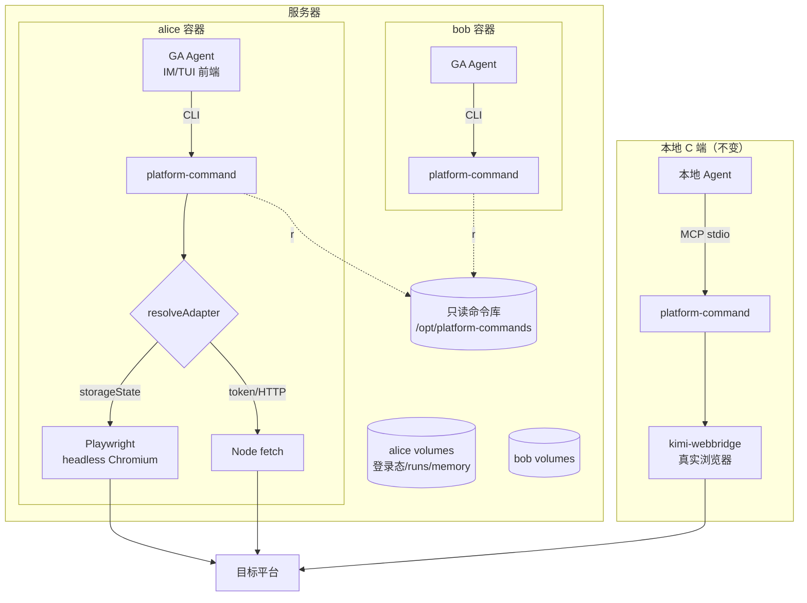

# 多用户 Agent 平台操作环境 模块需求与设计一体化文档

> **文档编号**: MOD-MUAD-v1.0
> **文档版本**: v1.0
> **创建日期**: 2026-06-10
> **文档状态**: 草稿
> **来源 PRD**: `multi-user-agent-deployment.prd.md`（PRD-20260610-01 v1.1）

**ID 体系**: US（用户故事，来自 PRD）、FEAT（功能）、CLI/FN（接口）、RULE（规则）、TC（测试用例）、RISK（风险）、NFR（非功能指标）
场景编号：S-（正常）、E-（异常）、B-（边界）

---

## 1. 文档控制

### 1.1 责任人

| 角色 | 姓名 | 职责范围 |
|------|------|---------|
| 产品经理 | jahan | 需求定义、业务验收 |
| 开发负责人 | jahan | 技术方案、代码实现 |

### 1.2 修订历史

| 版本 | 日期 | 作者 | 变更描述 |
|------|------|------|---------|
| v1.0 | 2026-06-10 | jahan | 由 PRD v1.1 派生，技术设计完成 |

---

## 2. 需求分析

### 2.1 需求概述 [必填]

| 项目 | 内容 |
|------|------|
| **模块名称** | 多用户 Agent 平台操作环境（服务器部署） |
| **模块ID** | MOD-MUAD |
| **所属系统/产品线** | platform-command + GenericAgent 部署形态 |
| **需求类型** | 新功能（部署形态）+ 功能扩展（Playwright 适配器） |
| **业务背景** | platform-command 当前为单用户本地工具（webbridge 操作本人浏览器活跃 tab）。团队需要服务器部署一套 GA + platform-command 环境供多人调用目标平台，且每人每次操作完全独立。单实例共享 Agent 的信任模型不成立（身份由 LLM 判定，提示注入可跨身份）。 |
| **核心目标** | 提供"每用户一容器"的多用户平台操作环境：统一镜像与命令库，按用户隔离身份、登录态、执行记录与输出；同时保证本地 C 端单用户用法零破坏。 |

### 2.2 痛点与价值 [必填]

| 维度 | 内容 |
|------|------|
| **目标用户** | ① 业务用户（≤10 人起步，架构上限约几十人）；② 管理员；③ 本地 C 端用户（向后兼容对象） |
| **当前问题** | 无多用户能力：浏览器会话为全局单例，run/输出无归属；多人共用即共享同一平台身份 |
| **业务影响** | 无法服务器化统一部署；命令库版本分散、无审计 |
| **预期价值** | 一套环境服务全团队，操作互不可见，记录可按人审计 |

**用户故事**（继承自 PRD §3.2）

| 编号 | 用户故事 | 优先级 |
|------|---------|--------|
| US-01 | 业务用户通过自己的入口用自己的登录态执行平台操作，结果只归属自己 | P0 |
| US-02 | 业务用户可提供/更新自己的平台凭证（token 或浏览器登录态） | P0 |
| US-03 | 管理员脚本化分钟级开通新用户隔离环境 | P0 |
| US-04 | 命令库统一维护，用户不能注入自己的命令代码 | P1 |
| US-05 | 每条执行记录有用户归属，可按人审计 | P1 |
| US-06 | 登录态失效时被明确告知并能便捷重新提供 | P1 |
| US-07 | 本地 C 端用户升级后 MCP stdio + webbridge 用法行为完全不变 | P0 |

### 2.3 功能方案 [必填]

#### 2.3.1 功能清单

| 功能ID | 功能名称 | 功能描述 | 优先级 | 来源 |
|--------|---------|---------|--------|------|
| FEAT-01 | 基础 Docker 镜像 | Playwright 官方镜像为底 + Python 3.12 + GA + platform-command + 只读命令库 + 入口脚本 | P0 | US-01, US-03 |
| FEAT-02 | 每用户容器编排与开通 | compose 模板 + 开通脚本：per-user volumes + env 注入 userId 与渠道凭证 | P0 | US-01, US-03 |
| FEAT-03 | Playwright 浏览器适配器 | `resolveAdapter` 新增 Playwright 分支：headless 下用 storageState 执行 browser_session 类命令 | P0 | US-01, US-02 |
| FEAT-04 | 登录态接入 | token 走 env 直连；storageState 本地导出后导入容器专属 volume | P0 | US-02 |
| FEAT-05 | 会话过期探测与重登提示 | 401/403 → 标记 session 失效，返回重导入指引 | P1 | US-06 |
| FEAT-06 | run 记录归属 | run 记录写入可选 userId 字段，按用户目录隔离 | P1 | US-05 |
| FEAT-07 | 输出路径沙箱 | 服务器模式下输出路径收敛到用户 output 目录 | P1 | US-01 |
| FEAT-08 | 命令库只读管控 | 全局命令库只读挂载 `/opt/platform-commands` | P1 | US-04 |
| FEAT-09 | GA 工具约束（软裁剪） | 容器内约束 GA 浏览器注入/键鼠/视觉工具（headless 自然失效 + SOP 注入 GA memory + 沙箱兜底），平台操作统一经 platform-command CLI | P1 | US-01 |
| FEAT-10 | 本地模式向后兼容 | 多用户改动全部增量可选；无服务器 env 时行为与现版本一致 | P0 | US-07 |

#### 2.3.2 字段约束 [按需]

**FEAT-03/04 服务器模式环境变量**

| 字段名 | 字段类型 | 必填 | 约束 | 说明 |
|--------|---------|------|------|------|
| `PLATFORM_COMMAND_USER_ID` | string | 服务器模式必填 | kebab-case，非空 | 用户身份，仅来自容器 env |
| `PLATFORM_COMMAND_STORAGE_STATE` | string(path) | 浏览器命令需要 | 指向存在的 JSON 文件 | Playwright storageState 路径，设置即启用 Playwright 适配器 |
| `PLATFORM_COMMAND_OUTPUT_DIR` | string(path) | 服务器模式建议 | 绝对路径 | 输出沙箱根目录，设置即启用路径收敛 |
| `PLATFORM_COMMANDS_DIR` | string(path) | 否 | 已有变量 | 外部命令目录（容器内指向只读挂载） |

### 2.4 范围与边界 [必填]

| 类别 | 内容 |
|------|------|
| **范围（In Scope）** | 镜像构建；每用户容器编排与开通脚本；Playwright 适配器；token/storageState 登录态通道；run 归属、输出沙箱、命令库只读、GA 工具裁剪；本地模式向后兼容保障 |
| **非范围（Out of Scope）** | 共享浏览器会话 daemon；远程扫码/可视化首登；MCP Streamable HTTP 多租户；单实例多用户形态（明确不做）；riskLevel 服务端 RBAC |
| **前置假设** | 用户规模几十人内，每容器一个 Chromium 内存可接受；用户能本地导出登录态或持有 token；服务器可跑 Docker；GA headless（TUI/IM 前端）可用 |
| **有意妥协 / 技术债** | ① 每容器独立 Chromium，内存换隔离简单性；用户量上来后偿还为共享 daemon。② storageState 人工导入体验差；后续偿还为远程首登流程。③ per-host 限流本期不做，靠小规模试点控制风控风险（见 RISK-01）。 |

### 2.5 验收条件 [必填]

#### 2.5.1 业务规则与约束

| ID | 类型 | 描述 |
|----|------|------|
| RULE-01 | 系统约束 | `execute` 默认 dry-run，真实执行必须 `--execute-real --confirm`，任何新增代码路径不得绕过 |
| RULE-02 | 系统约束 | playwright 保持 optionalDependency；缺失时 list/describe/verify/HTTP 类 execute 不受影响 |
| RULE-03 | 安全规则 | userId 仅来自容器环境变量，禁止作为 command 参数或 MCP tool 入参传递 |
| RULE-04 | 安全规则 | 任何凭证（token/storageState/IM 凭证）不进镜像、不进 git、不进 command JSON |
| RULE-05 | 兼容规则 | command JSON schema 与 MCP tools schema 不发生破坏性变更（never break userspace） |

#### 2.5.2 功能验收场景

**正常场景**

| 场景ID | 功能ID | 优先级 | 前置条件 | 操作步骤 | 预期结果 |
|--------|--------|--------|---------|---------|---------|
| S-01 | FEAT-01 | P0 | 镜像构建完成 | 容器内运行 `platform-command list`、GA TUI 启动、headless Chromium 启动 | 三者均正常，镜像内无任何凭证 |
| S-02 | FEAT-02 | P0 | 基础镜像就绪 | 运行开通脚本创建用户 alice | 分钟级完成；alice 容器常驻，env 含 userId，三类 volume 挂载正确 |
| S-03 | FEAT-03 | P0 | 容器内有有效 storageState，无 webbridge | 真实执行一个 `browser_session_cookie` 命令 | 命令成功，数据来自该用户登录态 |
| S-04 | FEAT-04 | P0 | 用户配置了 API token env | 执行 token 类命令 | 直接成功，不经浏览器 |
| S-05 | FEAT-06 | P1 | 服务器模式（设 userId） | 执行任意命令 | run 记录 JSON 含 `userId: "alice"` |
| S-06 | FEAT-10 | P0 | 本地环境，未设任何新 env | 跑现有 `npm test` + webbridge 命令 dry-run | 全量通过；readiness 提示文案与现版本一致 |
| S-07 | FEAT-02 | P0 | alice、bob 两容器并行 | 双方同时执行同一命令 | 各自用各自登录态，run/输出互不可见 |

**异常场景**

| 场景ID | 功能ID | 触发条件 | 系统行为 | 用户感知 |
|--------|--------|---------|---------|---------|
| E-01 | FEAT-03 | storageState 文件缺失或损坏 | 报错并指向导入流程，不回退 webbridge | 明确的"如何导入登录态"指引 |
| E-02 | FEAT-05 | 目标平台返回 401/403 | 标记 session 失效，写入 run 记录，不静默重试 | 收到重新提供登录态的指引 |
| E-03 | FEAT-07 | 服务器模式下 output.path 指向沙箱外 | 拒绝执行，报错说明沙箱边界 | 错误信息含允许的根目录 |
| E-04 | FEAT-02 | 用户对话诱导"以他人身份执行" | userId 来自 env，执行身份不变 | 仍以本人身份执行 |
| E-05 | FEAT-10 | 本地环境 playwright 未安装 | HTTP 类命令照常执行，浏览器命令提示走 webbridge | 与现版本一致 |

**边界场景**

| 场景ID | 字段/条件 | 边界值 | 预期行为 |
|--------|----------|--------|---------|
| B-01 | 同一用户并发执行浏览器命令 | 2 个并发请求 | 同一 BrowserContext 内串行排队，结果互不污染 |
| B-02 | 容器崩溃重建 | volume 保留 | 登录态、run 记录、GA memory 完整恢复 |
| B-03 | `PLATFORM_COMMAND_STORAGE_STATE` 设置但 `USER_ID` 未设置 | 部分配置 | 启动时显式报错"服务器模式配置不完整"，不静默降级 |

#### 2.5.3 非功能指标

| 指标ID | 类型 | 目标值 | 测量方法 |
|--------|------|-------|---------|
| NFR-PERF-01 | 性能 | 日常操作无容器启动等待；新用户开通 ≤ 分钟级 | 开通脚本实测 |
| NFR-REL-01 | 可靠性 | 单容器故障不影响其他用户；volume 数据容器重建后保留 | 故障注入验证（B-02） |
| NFR-SEC-01 | 安全 | userId 不可被对话层篡改 | E-04 用例 |
| NFR-SEC-02 | 安全 | 凭证独立 volume、可单独销毁、不进镜像 | 镜像扫描 + S-01 |
| NFR-SEC-03 | 安全 | 容器沙箱：命令库只读、资源配额、按需出网限制 | compose 配置审查 |
| NFR-COMPAT-01 | 兼容 | Playwright 镜像/依赖/浏览器三者版本对齐（v1.52） | 构建时校验 |
| NFR-COMPAT-02 | 兼容 | 本地默认路径零变更 | S-06 用例 + 全量回归 |

---

## 3. 技术设计

### 3.1 方案选型 [必填]

#### 关键决策记录

| 决策点 | 选择 | 被否决项 | 理由 | 可逆性 |
|--------|------|---------|------|--------|
| 多用户隔离形态 | 每用户一容器（OS 级隔离） | ① 单实例多租户服务；② 共享 Agent + 会话 daemon | 单实例下身份由 LLM 判定，提示注入可跨身份，信任模型不成立；容器把"写对代码"换成"配对部署"，文件系统/记录/凭证隔离免费获得 | 难回退，但可演进为 daemon 优化 |
| 浏览器能力载体 | 容器内 Playwright + storageState | ① webbridge 进容器（无真人浏览器载体，不成立）；② 共享浏览器 daemon（过度设计） | Playwright 已是 optionalDependency；BrowserContext 即为多会话隔离设计；10 人内每容器一个 Chromium 内存可接受 | 易演进为 daemon |
| 用户身份注入 | 容器环境变量 | MCP tool 参数 / command 参数 | 身份必须绑定在模型不可篡改层；tool 参数可被提示注入伪造 | 不可逆（安全基线） |
| 基础镜像 | `mcr.microsoft.com/playwright:v1.52.0-noble` | debian + 手动装 Chromium 依赖 | 官方镜像已处理全部系统库；版本与 package.json `^1.52.0` 对齐 | 易回退 |
| GA 调用 platform-command | CLI（终端工具） | MCP | GA 无 MCP 客户端；CLI 兜底正是框架设计意图 | 易（GA 加 MCP 客户端后可切换） |
| 服务器模式开关 | 显式 env（`STORAGE_STATE`/`USER_ID`/`OUTPUT_DIR`） | 自动探测（容器检测/webbridge 探活降级） | 显式优于隐式；自动探测会让本地行为依赖环境噪声，违背 NFR-COMPAT-02 | 易回退 |

#### 技术栈

| 类别 | 选型 | 版本 | 选型理由 |
|------|------|------|---------|
| 框架核心 | TypeScript / Node | >=18, ESM | 现有栈 |
| Agent | GenericAgent (Python) | 3.11/3.12，GA_REF 锁版本 | 第三方开源（lsdefine/GenericAgent）、IM 前端齐全、headless 官方支持；不改上游不 fork，安装遵循官方 installation_zh.md（源码可编辑安装，非 PyPI 包） |
| 浏览器自动化 | Playwright (optionalDependency) | ^1.52.0 | 已有依赖声明；storageState/BrowserContext 原生支持 |
| 容器编排 | Docker Compose | v2 | 单机几十用户规模够用，无需 K8s |
| 镜像底座 | mcr.microsoft.com/playwright | v1.52.0-noble | 与依赖版本对齐 |

### 3.2 架构设计 [必填]



#### 适配器选择逻辑（FEAT-03/10 核心）

```
resolveAdapter(command):
  authType != 'browser_session_cookie'        → Node fetch（现状，不变）
  authType == 'browser_session_cookie':
    PLATFORM_COMMAND_STORAGE_STATE 已设置     → Playwright 适配器（服务器模式）
    未设置                                    → webbridge（现状，含现有报错文案，不变）
```

> 判定只看显式 env，不做环境自动探测——本地用户未设置任何新变量时，代码路径与现版本逐行一致（FEAT-10）。

#### 外部依赖清单

| 外部系统 | 依赖类型 | 协议 | 超时 | 降级策略 |
|---------|---------|------|------|---------|
| 目标平台 | 数据源 | HTTPS | 15s（现有 `PLATFORM_COMMAND_FETCH_TIMEOUT_MS`） | 401/403 → session 失效流程（FEAT-05） |
| IM 渠道（企微/钉钉/TG） | GA 前端 | 各渠道协议 | GA 内部 | 容器内 GA 自行重连 |
| Playwright Chromium | 浏览器执行 | 进程内 | 启动 30s | 启动失败报错指向镜像版本核对 |

### 3.3 数据设计 [必填]

无数据库。文件布局即数据设计：

**容器 volume 布局（每用户）**

| 挂载点 | volume | 内容 | 敏感度 |
|--------|--------|------|--------|
| `/secrets/storage-state/` | `<user>-secrets` | `<platform>.storageState.json` | 高（可单独销毁） |
| `/data/platform/` | `<user>-data` | `.platform-command/runs/`、`output/` | 中 |
| `/data/ga/` | `<user>-ga` | GA memory/skill/会话历史 | 中 |
| `/opt/platform-commands` | 宿主机目录 | 全局命令库 | 只读挂载 |

**run 记录 schema 变更（`runs.ts`，增量可选字段）**

| 字段名 | 类型 | 可空 | 说明 |
|--------|------|------|------|
| `userId` | string | Y | 来自 `PLATFORM_COMMAND_USER_ID`；未设置时字段省略（本地兼容） |
| `adapter` | string | Y | `webbridge` / `playwright` / `node_http`，便于审计与排障 |
| 其余字段 | — | — | 不变 |

**容量预估**

| 维度 | 预估值 |
|------|--------|
| 单容器内存 | GA(Python) + Node + headless Chromium ≈ 1–1.5GB（量级估计，试点实测修正） |
| 10 用户服务器 | 16GB RAM 起步；磁盘按 run 记录 + 输出，每用户 <1GB/月 量级 |

### 3.4 接口设计 [必填]

#### 形态 B：CLI / 运维脚本

| 命令 | 参数 / Flag | 说明 | 退出码 |
|------|------------|------|--------|
| `platform-command *`（CLI-00） | 不变 | 现有全部子命令行为不变（FEAT-10） | 不变 |
| `deploy/provision-user.sh`（CLI-01） | `<userId>` `[--im wecom\|dingtalk\|tg]` | 生成 compose service + 三个 volume + env 模板，启动容器 | 0=成功；2=用户已存在 |
| `deploy/import-storage-state.sh`（CLI-02） | `<userId> <platform> <file>` | 校验 JSON 后放入用户 secrets volume，重载会话 | 0=成功；3=文件非法 |
| `deploy/build-image.sh`（CLI-03） | `[--tag]` | 构建基础镜像，构建时校验 Playwright 三方版本对齐（NFR-COMPAT-01）；tag 绑定 platform-command 与 GA 双版本（如 `muad:pc0.4.0-ga2026.06.10`） | 0=成功 |
| `deploy/upgrade.sh`（CLI-04） | `[--users a,b]\|[--all]` | 拉新镜像滚动重建容器（volume 不动，秒级重启）；默认先试点用户，`--all` 需镜像已过试点 | 0=成功 |
| `deploy/fleet-status.sh`（CLI-05） | `[--json]` | 汇总全部用户容器：健康/内存/session 失效/近期 run 失败率（批量 doctor） | 0=全部健康；1=存在异常 |

> 部署产物统一放本仓库 `deploy/` 目录：`Dockerfile`、`compose.template.yml`、三个脚本、GA 工具裁剪配置（FEAT-09）。

#### 形态 C：函数 / 库接口（platform-command 内部）

| 接口ID | 函数签名 | 实现 FEAT | 错误处理 |
|--------|---------|----------|---------|
| FN-01 | `resolveAdapter(command) -> { viaBrowser, session, adapter }` | FEAT-03/10 | 服务器模式配置不完整 → 显式抛错（B-03） |
| FN-02 | `fetchViaPlaywright(url, init, { storageStatePath }) -> body`（新模块 `src/playwright_adapter.ts`，动态 import，对齐 `webbridge.ts` 同名能力面） | FEAT-03 | 401/403 → `err.authRequired = true`，进入 FEAT-05 流程 |
| FN-03 | `ensurePlaywrightSession(targetUrl, opts)` / `resolveSessionFromPlaywright()` | FEAT-03 | storageState 缺失/损坏 → 报错含导入指引（E-01） |
| FN-04 | `resolveOutputPath(requested) -> string` | FEAT-07 | `OUTPUT_DIR` 已设且越界 → 抛错（E-03）；未设 → 原样返回（本地兼容） |
| FN-05 | `recordRun(run)` 增量：自动附加 `userId`/`adapter` 可选字段 | FEAT-06 | 无 env 时字段省略，旧记录可读 |
| FN-06 | `markSessionInvalid(platform)` + readiness 集成 | FEAT-05 | 失效状态写入用户 data volume，dry-run readiness 可见 |

> Playwright 必须动态 `import()`（对齐现有 webbridge 的用法），保证 optionalDependency 缺失时其余功能不受影响（RULE-02）。

### 3.5 质量实现方案 [必填]

#### 性能设计

| 指标ID | 热点路径 | 目标值 | 实现方案（含被放弃的较慢方案） |
|--------|---------|-------|------------------------------|
| NFR-PERF-01 | 用户发起操作 → 命令执行 | 无容器启动等待 | 容器常驻 + Chromium 进程在适配器首次使用时懒启动并复用（放弃：每命令冷启动浏览器，单次多 3–5s；放弃：预启动全部用户浏览器，闲置内存浪费） |
| NFR-PERF-01 | 新用户开通 | ≤ 分钟级 | 预构建镜像 + 脚本化 compose 注入（放弃：开通时现场构建镜像，10 分钟级） |

#### 可靠性设计

| 风险ID | 失效模式 | 影响 | 应对措施 |
|--------|---------|------|---------|
| RISK-A | Chromium 进程崩溃/泄漏 | 该用户浏览器命令失败 | 适配器每次校验进程存活，失活重启；容器内存上限兜底 OOM 重启 |
| RISK-B | storageState 半写入损坏 | 登录态不可用 | 导入脚本先校验 JSON 再原子落盘（temp+rename） |
| RISK-C | 单容器故障 | 仅该用户受影响 | compose `restart: unless-stopped`；volume 外置（B-02） |

#### 安全性设计

| 指标ID | 验收标准 | 实现方案 |
|--------|---------|---------|
| NFR-SEC-01 | 对话层无法变更执行身份 | userId 仅读容器 env（FN-05），不暴露任何写入口；E-04 用例回归 |
| NFR-SEC-02 | 凭证不进镜像、可单独销毁 | secrets 独立 volume；Dockerfile 无 COPY 凭证路径；CI 镜像扫描 |
| NFR-SEC-03 | 容器为不可信沙箱 | 命令库 `:ro` 挂载（含 signer 代码）；compose 设 mem/cpu limit；出网按平台域名白名单（可选启用） |

#### 可观测性设计

| 场景 | 实现方案 |
|------|---------|
| 执行审计 | run 记录含 userId/adapter（FN-05），管理员脚本汇总各用户 data volume |
| 会话健康 | dry-run readiness 暴露 session 失效状态（FN-06），管理员可批量 doctor |

---

## 4. 部署与运维

### 4.1 部署架构

| 环境 | 配置 | 实例数 | 用途 |
|------|------|--------|------|
| 试点 | 8C16G | 2–3 用户容器 | 验证风控与内存实测 |
| 生产 | 16C32G | ≤20 用户容器 | 全团队；超出后评估共享 daemon |

### 4.2 发布与回滚

| 阶段 | 范围 | 进入条件 | 回滚条件 |
|------|------|---------|---------|
| platform-command npm 发布 | 本地 C 端 + 服务器 | `prepack`（build+test）通过 + S-06 兼容回归 | 本地用户报任何行为变化 → 回退版本（增量 env 设计保证可回退） |
| 镜像灰度 | 2–3 试点用户 | 镜像构建 + S-01~S-04 通过 | 浏览器命令成功率异常 / 目标平台风控信号 |
| 全量开通 | 全部用户 | 试点 1–2 周无 RISK-01 征兆 | — |

**版本升级流程（platform-command / GA 更新同步）**

```
源更新（npm 发版 / GA 仓库打 tag）
  → CLI-03 build-image.sh（tag 绑定双版本）
  → CLI-04 upgrade.sh --users <试点>（滚动重建，volume 不动）
  → 观察 §4.3 指标 1–2 天
  → CLI-04 upgrade.sh --all
回滚 = 用上一个镜像 tag 重跑 upgrade.sh（容器无状态，数据全在 volume）
```

> 升级前提：run schema 与 storageState 格式向后兼容（RULE-05）；引入不兼容变更时 upgrade.sh 必须附带迁移步骤。不使用 watchtower 类自动更新——自动化"执行"，不自动化"升级决策"。

### 4.5 运维模型与配置职责

**配置职责分工**（划分原则：构成"身份绑定"的配置归管理员，用户不可触碰）

| 配置项 | 归属 | 注入方式 | 理由 |
|--------|------|---------|------|
| IM 机器人凭证、渠道账号↔userId 映射 | 管理员 | 开通时 per-user env 文件 | 即系统认证层（NFR-SEC-01 延伸）；用户可改 = 可绑他人账号 |
| LLM API key | 管理员 | 统一团队 key，env 注入，按容器记账 | 用户无需持有；便于配额与成本归集 |
| `PLATFORM_COMMAND_USER_ID` 等服务器 env | 管理员 | 开通脚本生成 | 身份基线 |
| 目标平台凭证（token / storageState） | 用户（管理员协助导入） | CLI-02 | 用户自己的平台身份，唯一自助项 |

**运维动作清单**（管理员日常仅四项）

| 动作 | 工具 | 频率 |
|------|------|------|
| 开通/注销用户 | CLI-01 / volume 销毁 | 按需 |
| 版本升级 | CLI-03 + CLI-04 | 跟随发版 |
| 登录态协助 | CLI-02 | 用户 session 失效时 |
| 告警响应 | CLI-05 + §4.3 告警 | 被动触发 |

> 成本控制核心：N 个容器 = 1 镜像 × 1 compose 模板 × N 份 env 文件，无 per-user 特殊逻辑；`restart: unless-stopped` + healthcheck 自愈，不做人工巡检。

### 4.3 监控告警

| 指标 | 阈值 | 级别 | 处理 |
|------|------|------|---------|
| 容器内存 | >90% limit | P2 | 排查 Chromium 泄漏，重启容器 |
| 命令 401/403 率 | 单用户连续 ≥3 次 | P2 | 触发 FEAT-05 重登指引 |
| 目标平台异常响应（风控征兆） | 出现验证码/封禁响应 | P1 | 暂停该平台命令，人工评估（RISK-01） |

---

## 5. 风险与依赖

### 5.1 项目依赖

| 依赖模块/团队 | 依赖内容 | 状态 | 风险等级 |
|-------------|---------|------|---------|
| Playwright 官方镜像 | v1.52.0-noble | 可用 | 低 |
| GenericAgent | headless 前端（tuiapp_v2/IM adapters）、mykey.py 凭证约定 | 第三方开源，GA_REF 锁版本；工具约束走软裁剪（自然失效+SOP+沙箱），不依赖上游改动 | 中 |
| IM 渠道 | 每用户机器人凭证 | 开通时提供 | 低 |
| 目标平台 | 对 headless/服务器 IP 的风控政策 | 未知，试点验证 | 中 |

### 5.2 风险识别（继承 PRD §7.2，补充概率）

| 风险ID | 类型 | 描述 | 概率 | 影响 | 应对措施 |
|--------|------|------|------|------|---------|
| RISK-01 | 外部 | 同出口 IP 多账号高频访问触发目标平台风控 | 中 | 高 | 试点观察；监控风控征兆（§4.3）；后续在 `fetchStepJson` 单点加 per-host 限流退避（本期技术债） |
| RISK-02 | 体验 | storageState 过期频繁 | 高 | 中 | token 优先；FEAT-05 探测 + CLI-02 快捷重导入 |
| RISK-03 | 安全 | 提示注入滥用容器内权限 | 中 | 高 | NFR-SEC-03 沙箱 + FEAT-09 裁剪 + FEAT-08 只读 |
| RISK-04 | 工程 | GA 容器化/会话持久化成熟度不足 | 中 | 中 | 第三方项目按 GA_REF 锁版本，定制限于镜像层（entrypoint 软链持久化、SOP 注入），不动上游；试点 2–3 人再放量 |
| RISK-05 | 兼容 | 适配器改动破坏本地 webbridge 路径 | 低 | 高 | 判定只看显式 env；S-06/E-05 进回归；npm 发布前全量测试 |

---

## 6. 需求追溯矩阵

| 用户故事 | 功能ID | 接口ID | 测试用例ID | 状态 |
|---------|--------|--------|-----------|------|
| US-01 | FEAT-01 | CLI-03 | S-01 | 待开发 |
| US-01 | FEAT-02 | CLI-01 | S-02, S-07, E-04 | 待开发 |
| US-01 | FEAT-07 | FN-04 | E-03 | 待开发 |
| US-01 | FEAT-09 | deploy/GA 配置 | S-01（裁剪生效项） | 待开发 |
| US-02 | FEAT-03 | FN-01, FN-02, FN-03 | S-03, E-01, B-01, B-03 | 待开发 |
| US-02 | FEAT-04 | CLI-02 | S-04, B-02 | 待开发 |
| US-03 | FEAT-01, FEAT-02 | CLI-01, CLI-03 | S-01, S-02 | 待开发 |
| US-04 | FEAT-08 | compose `:ro` 挂载 | NFR-SEC-03 审查项 | 待开发 |
| US-05 | FEAT-06 | FN-05 | S-05 | 待开发 |
| US-06 | FEAT-05 | FN-06 | E-02 | 待开发 |
| US-07 | FEAT-10 | FN-01（默认分支）, CLI-00 | S-06, E-05 | 待开发 |

> 矩阵闭合：7 US → 10 FEAT → 接口（CLI-00~03 / FN-01~06）→ 场景（S-01~07 / E-01~05 / B-01~03）无断点。

---

## 附录：术语表

| 术语 | 定义 |
|------|------|
| GA | GenericAgent，第三方开源的极简自治 Agent 框架（lsdefine/GenericAgent，~3K 行 Python） |
| storageState | Playwright 浏览器登录态快照（cookie + localStorage） |
| BrowserContext | Playwright 的隔离浏览器上下文，cookie/存储互不可见 |
| webbridge | kimi-webbridge，本地桌面浏览器桥接（C 端路径，保持不变） |
| 服务器模式 | 显式设置 `PLATFORM_COMMAND_USER_ID` 等 env 后启用的多用户行为 |

---

*文档结束*
